# Vietnamese Traditional Medicine Company — Hướng dẫn Cấu hình Azure Portal (GUI) Step-by-Step

> **Tài liệu hướng dẫn toàn diện** cách cấu hình thủ công (bằng tay) toàn bộ hạ tầng Azure cho dự án Cloud Migration thông qua giao diện Azure Portal, thay cho việc sử dụng Terraform CLI.

**Phiên bản:** 1.0  
**Ngày cập nhật:** 16/08/2026  
**Tác giả:** VTMC IT Team  
**Dự án:** VTMC Cloud Migration — Azure Infrastructure  

---

## Mục lục

1. [Đăng nhập Azure Portal](#1-đăng-nhập-azure-portal)
2. [Tạo Resource Group](#2-tạo-resource-group)
3. [Tạo Virtual Network & Subnets](#3-tạo-virtual-network--subnets)
4. [Tạo Azure Front Door & WAF](#4-tạo-azure-front-door--waf)
5. [Tạo Azure Key Vault](#5-tạo-azure-key-vault)
6. [Tạo Azure Kubernetes Service (AKS)](#6-tạo-azure-kubernetes-service-aks)
7. [Tạo Azure SQL Managed Instance](#7-tạo-azure-sql-managed-instance)
8. [Tạo Azure Cosmos DB](#8-tạo-azure-cosmos-db)
9. [Tạo Azure API Management](#9-tạo-azure-api-management)
10. [Tạo Azure Service Bus](#10-tạo-azure-service-bus)
11. [Tạo Azure Event Hub](#11-tạo-azure-event-hub)
12. [Tạo Azure OpenAI & Face API](#12-tạo-azure-openai--face-api)
13. [Tạo Log Analytics & Application Insights](#13-tạo-log-analytics--application-insights)

---

## Tổng quan Kiến trúc

Hạ tầng Azure của VTMC bao gồm các thành phần chính sau:

| Thành phần | Dịch vụ Azure | Mục đích |
|---|---|---|
| Mạng ảo | Virtual Network | Mạng nội bộ cho toàn bộ hạ tầng |
| CDN & WAF | Azure Front Door | Phân phối nội dung & tường lửa ứng dụng |
| Bảo mật | Azure Key Vault | Quản lý khóa, chứng chỉ, bí mật |
| Container | Azure Kubernetes Service | Orchestration cho microservices |
| CSDL quan hệ | SQL Managed Instance | Cơ sở dữ liệu chính cho ERP/CRM |
| CSDL NoSQL | Cosmos DB (MongoDB API) | Dữ liệu phi cấu trúc, catalog sản phẩm |
| API Gateway | API Management | Quản lý & bảo vệ API |
| Messaging | Service Bus | Hàng đợi tin nhắn giữa microservices |
| Streaming | Event Hub | Thu thập sự kiện & telemetry |
| AI/ML | Azure OpenAI & Face API | Trí tuệ nhân tạo & nhận diện khuôn mặt |
| Giám sát | Log Analytics & App Insights | Theo dõi & cảnh báo hệ thống |

> [!IMPORTANT]
> Tất cả tài nguyên trong hướng dẫn này sử dụng **Subscription: Azure subscription 1** và **Region: (Asia Pacific) Southeast Asia** để đảm bảo độ trễ thấp nhất cho người dùng tại Việt Nam.

---

## 1. Đăng nhập Azure Portal

### 1.1. Giới thiệu

Azure Portal là giao diện web quản trị chính của Microsoft Azure. Đây là nơi bạn tạo, cấu hình và quản lý tất cả các tài nguyên đám mây. Đối với dự án VTMC, chúng ta sẽ sử dụng Azure Portal để thiết lập toàn bộ hạ tầng production.

### 1.2. Các bước thực hiện

1. Mở trình duyệt web (khuyến nghị **Microsoft Edge** hoặc **Google Chrome** phiên bản mới nhất).
2. Truy cập địa chỉ: **https://portal.azure.com**
3. Nhập **email** của tài khoản Microsoft/Azure AD đã được cấp quyền.
4. Nhập **mật khẩu** và hoàn tất xác thực đa yếu tố (MFA) nếu được yêu cầu.
5. Sau khi đăng nhập thành công, bạn sẽ thấy trang chủ Azure Portal như hình bên dưới.

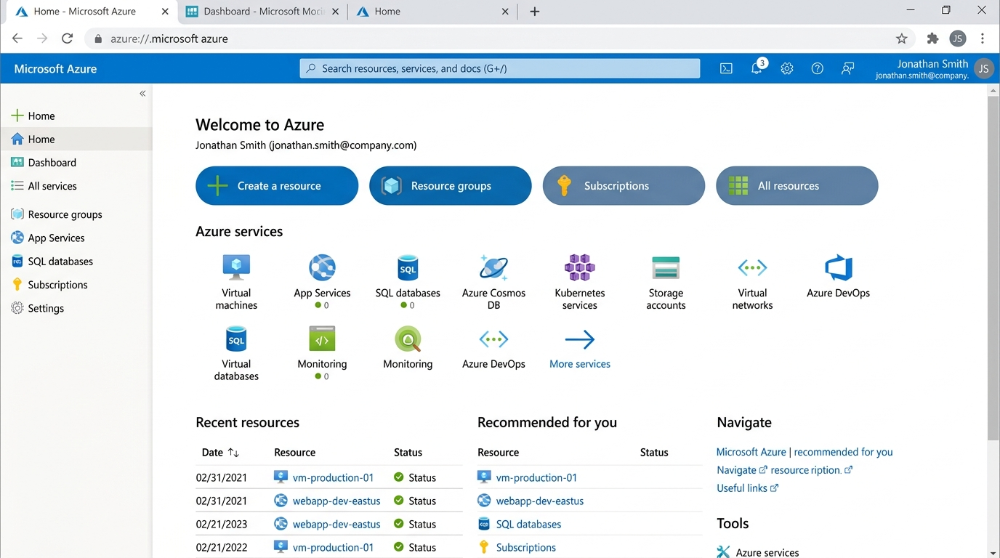

6. Kiểm tra **Subscription** hiện tại ở góc trên bên phải. Đảm bảo đang sử dụng **Azure subscription 1**.
7. Nếu subscription không đúng, nhấn vào biểu tượng **Settings** (⚙️) trên thanh công cụ → chọn tab **Directories + subscriptions** → chuyển sang subscription đúng.

> [!TIP]
> Bạn có thể đánh dấu trang Azure Portal vào bookmark để truy cập nhanh hơn. Ngoài ra, hãy cài đặt **Azure Mobile App** trên điện thoại để theo dõi tài nguyên mọi lúc mọi nơi.

> [!WARNING]
> Đảm bảo tài khoản của bạn có quyền **Contributor** hoặc **Owner** trên subscription **Azure subscription 1** trước khi tiến hành các bước tiếp theo. Nếu không có đủ quyền, hãy liên hệ quản trị viên Azure AD của công ty.

### 1.3. Bảng tóm tắt cấu hình

| Thông tin | Giá trị |
|---|---|
| URL Azure Portal | https://portal.azure.com |
| Subscription | Azure subscription 1 |
| Trình duyệt khuyến nghị | Microsoft Edge / Google Chrome |
| Quyền yêu cầu | Contributor hoặc Owner |

---

## 2. Tạo Resource Group

### 2.1. Giới thiệu

**Resource Group** (Nhóm tài nguyên) là container logic trong Azure dùng để nhóm và quản lý tất cả các tài nguyên liên quan đến một dự án hoặc môi trường. Đối với VTMC, chúng ta tạo một Resource Group duy nhất cho môi trường production để dễ dàng quản lý chi phí, quyền truy cập và vòng đời tài nguyên.

### 2.2. Các bước thực hiện

1. Từ trang chủ Azure Portal, nhấn **"+ Create a resource"** ở góc trên bên trái hoặc tìm kiếm **"Resource groups"** trong thanh tìm kiếm.
2. Nhấn **"Resource groups"** trong kết quả tìm kiếm.
3. Nhấn nút **"+ Create"** để tạo Resource Group mới.

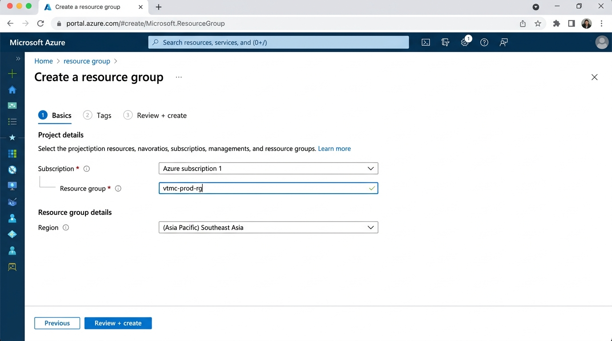

4. Trong tab **Basics**, điền các thông tin sau:
   - **Subscription:** Chọn `Azure subscription 1`
   - **Resource group:** Nhập `vtmc-prod-rg`
   - **Region:** Chọn `(Asia Pacific) Southeast Asia`

5. Nhấn **"Next: Tags >"** để chuyển sang tab Tags.
6. Thêm các tag sau để quản lý tài nguyên:
   - **Key:** `Project` → **Value:** `VTMC`
   - **Key:** `Environment` → **Value:** `Production`
   - **Key:** `ManagedBy` → **Value:** `IT-Team`

7. Nhấn **"Next: Review + create >"**.
8. Kiểm tra lại toàn bộ thông tin, đảm bảo validation hiển thị **"Validation passed"** ✅.
9. Nhấn **"Create"** để tạo Resource Group.
10. Đợi khoảng 5-10 giây, Azure sẽ tạo xong Resource Group. Nhấn **"Go to resource group"** để truy cập.

> [!TIP]
> Đặt tên Resource Group theo quy tắc: `{tên-dự-án}-{môi-trường}-rg`. Ví dụ: `vtmc-prod-rg` cho production, `vtmc-dev-rg` cho development. Điều này giúp phân biệt rõ ràng các môi trường.

> [!IMPORTANT]
> Resource Group **không thể thay đổi Region** sau khi tạo. Hãy chắc chắn chọn đúng **Southeast Asia** vì đây là region gần Việt Nam nhất, đảm bảo độ trễ thấp.

### 2.3. Bảng tóm tắt cấu hình

| Trường | Giá trị |
|---|---|
| Subscription | Azure subscription 1 |
| Resource group | `vtmc-prod-rg` |
| Region | (Asia Pacific) Southeast Asia |
| Tag: Project | VTMC |
| Tag: Environment | Production |
| Tag: ManagedBy | IT-Team |

---

## 3. Tạo Virtual Network & Subnets

### 3.1. Giới thiệu

**Virtual Network (VNet)** là mạng ảo riêng trong Azure, cho phép các tài nguyên Azure giao tiếp an toàn với nhau, với Internet và với mạng on-premises. VTMC cần VNet để:

- Cô lập các thành phần hạ tầng (AKS, SQL MI, Application Gateway) vào các subnet riêng biệt.
- Kiểm soát luồng traffic giữa các dịch vụ thông qua Network Security Groups (NSG).
- Kết nối an toàn từ hạ tầng on-premises tại nhà máy đến Azure thông qua VPN Gateway.

### 3.2. Các bước tạo Virtual Network

1. Từ trang chủ Azure Portal, nhấn **"+ Create a resource"**.
2. Trong thanh tìm kiếm, gõ **"Virtual Network"** và nhấn Enter.
3. Chọn **"Virtual Network"** từ kết quả, nhấn **"Create"**.

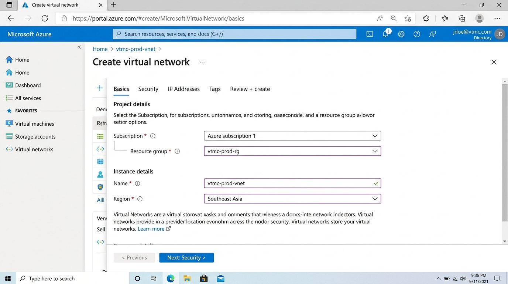

4. Trong tab **Basics**, điền:
   - **Subscription:** `Azure subscription 1`
   - **Resource group:** Chọn `vtmc-prod-rg`
   - **Virtual network name:** Nhập `vtmc-prod-vnet`
   - **Region:** `(Asia Pacific) Southeast Asia`

5. Nhấn **"Next: Security >"**.
6. Trong tab **Security**, bật các tùy chọn sau (nếu cần):
   - **Azure Bastion:** Bỏ chọn (sẽ cấu hình sau nếu cần)
   - **Azure Firewall:** Bỏ chọn (sử dụng Azure Front Door WAF thay thế)
   - **Azure DDoS Network Protection:** Chọn **Enable** nếu có ngân sách

7. Nhấn **"Next: IP Addresses >"**.

### 3.3. Cấu hình IP Addresses & Subnets

8. Trong tab **IP Addresses**:
   - **IPv4 address space:** Nhập `10.0.0.0/16` (cung cấp 65.536 địa chỉ IP)
   - Xóa subnet mặc định nếu có bằng cách nhấn biểu tượng thùng rác (🗑️).

9. Nhấn **"+ Add a subnet"** để thêm subnet thứ nhất:
   - **Subnet name:** `aks-subnet`
   - **Subnet address range:** `10.0.1.0/24` (254 địa chỉ IP khả dụng)
   - **Network Security Group:** None (sẽ gán sau)
   - Nhấn **"Add"**

10. Nhấn **"+ Add a subnet"** để thêm subnet thứ hai:
    - **Subnet name:** `agw-subnet`
    - **Subnet address range:** `10.0.2.0/24`
    - Nhấn **"Add"**

11. Nhấn **"+ Add a subnet"** để thêm subnet thứ ba:
    - **Subnet name:** `db-subnet`
    - **Subnet address range:** `10.0.3.0/24`
    - Nhấn **"Add"**

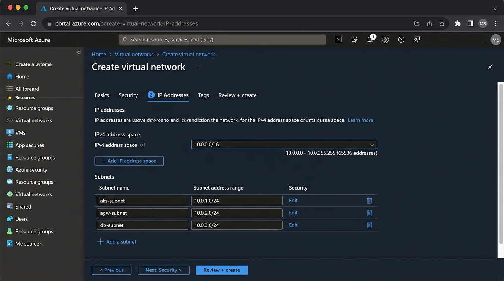

12. Nhấn **"Next: Tags >"**, thêm tags tương tự Resource Group.
13. Nhấn **"Next: Review + create >"**.
14. Kiểm tra validation hiển thị **"Validation passed"** ✅.
15. Nhấn **"Create"** và đợi deployment hoàn tất (khoảng 30 giây — 1 phút).

> [!WARNING]
> Không sử dụng dải địa chỉ IP trùng với mạng on-premises của VTMC. Nếu mạng nội bộ nhà máy sử dụng dải `10.0.0.0/16`, hãy đổi VNet sang dải khác như `10.1.0.0/16` để tránh xung đột khi thiết lập VPN Site-to-Site sau này.

> [!TIP]
> Subnet `/24` cung cấp 254 địa chỉ IP khả dụng. Đối với AKS, mỗi pod sử dụng 1 IP nên hãy đảm bảo subnet đủ lớn. Nếu cần mở rộng, có thể sử dụng `/22` (1.022 IPs) cho `aks-subnet`.

### 3.4. Bảng tóm tắt cấu hình

| Trường | Giá trị |
|---|---|
| VNet Name | `vtmc-prod-vnet` |
| Resource Group | `vtmc-prod-rg` |
| Region | (Asia Pacific) Southeast Asia |
| Address Space | `10.0.0.0/16` |
| Subnet 1 | `aks-subnet` — `10.0.1.0/24` |
| Subnet 2 | `agw-subnet` — `10.0.2.0/24` |
| Subnet 3 | `db-subnet` — `10.0.3.0/24` |

---

## 4. Tạo Azure Front Door & WAF

### 4.1. Giới thiệu

**Azure Front Door** là dịch vụ CDN (Content Delivery Network) toàn cầu kết hợp với **Web Application Firewall (WAF)** để bảo vệ ứng dụng web. VTMC cần Front Door để:

- **Tăng tốc truy cập** cho người dùng từ nhiều vùng địa lý (đại lý phân phối toàn quốc).
- **Bảo vệ ứng dụng** khỏi các cuộc tấn công web phổ biến (SQL Injection, XSS, DDoS Layer 7).
- **Cân bằng tải** giữa nhiều backend (AKS cluster, API Management).
- **SSL offloading** — quản lý chứng chỉ SSL tập trung.

### 4.2. Các bước thực hiện

1. Từ trang chủ Azure Portal, nhấn **"+ Create a resource"**.
2. Tìm kiếm **"Front Door and CDN profiles"** trong thanh tìm kiếm.
3. Chọn **"Front Door and CDN profiles"**, nhấn **"Create"**.
4. Chọn **"Azure Front Door"** (không phải Classic), nhấn **"Continue"**.

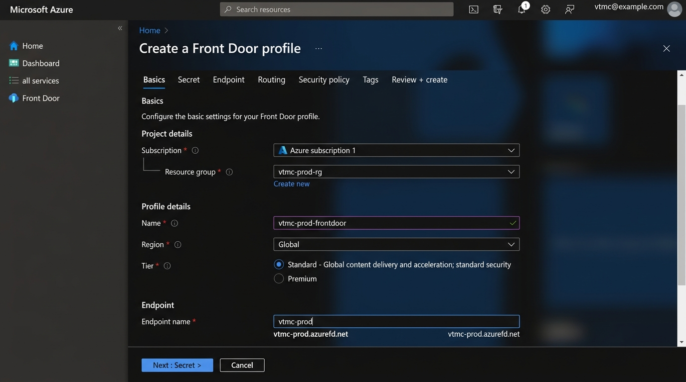

5. Trong tab **Basics**, điền:
   - **Subscription:** `Azure subscription 1`
   - **Resource group:** `vtmc-prod-rg`
   - **Name:** `vtmc-prod-frontdoor`
   - **Tier:** Chọn **Standard** (hoặc **Premium** nếu cần Private Link và advanced WAF rules)

6. Nhấn **"Next: Endpoint >"**.
7. Nhấn **"+ Add an endpoint"**:
   - **Endpoint name:** `vtmc-main`
   - Endpoint sẽ tự động tạo URL: `vtmc-main-xxxxxxxx.z01.azurefd.net`
   - Nhấn **"Add"**

8. Nhấn **"+ Add a route"** để cấu hình định tuyến:
   - **Name:** `default-route`
   - **Domains:** Chọn endpoint vừa tạo
   - **Patterns to match:** `/*`
   - **Accepted protocols:** `HTTPS only`
   - **Redirect:** Enable HTTPS redirect

9. Trong phần **Origin group**, nhấn **"Add a new origin group"**:
   - **Name:** `vtmc-backend-origins`
   - Nhấn **"+ Add an origin"**:
     - **Name:** `aks-origin`
     - **Origin type:** Custom
     - **Host name:** (sẽ cập nhật sau khi tạo AKS — nhập IP tạm thời hoặc FQDN)
     - **HTTP port:** `80`
     - **HTTPS port:** `443`
     - **Priority:** `1`
     - **Weight:** `1000`
   - **Health probe** settings:
     - **Path:** `/health`
     - **Protocol:** HTTPS
     - **Interval:** 30 giây

10. Nhấn **"Add"** để lưu route.

### 4.3. Cấu hình WAF Policy

11. Sau khi Front Door được tạo, truy cập **Front Door** → menu bên trái chọn **"Security policies"**.
12. Nhấn **"+ Add"** để tạo WAF policy mới:
    - **Name:** `vtmcWafPolicy`
    - **Policy mode:** `Prevention` (chặn tấn công thực tế, không chỉ ghi log)
13. Trong tab **Managed rules**, bật:
    - **Microsoft Default Rule Set (DRS)** — phiên bản mới nhất
    - **Microsoft Bot Manager Rule Set** — chống bot độc hại
14. Trong tab **Custom rules**, thêm rule chặn các quốc gia không cần thiết (tùy chọn):
    - **Rule name:** `BlockNonVNTraffic`
    - **Match type:** Geo-location
    - **Action:** Block (hoặc Log để thử nghiệm trước)
15. Nhấn **"Save"** để lưu WAF policy.
16. Quay lại **Security policies** → gán WAF policy vào endpoint.

> [!WARNING]
> **WAF ở chế độ Prevention** sẽ chặn request vi phạm ngay lập tức. Nên bắt đầu với chế độ **Detection** trong 1-2 tuần đầu để theo dõi false positive, sau đó mới chuyển sang **Prevention**.

> [!TIP]
> Sau khi tạo Front Door, hãy cấu hình **custom domain** (ví dụ: `app.vtmc.com.vn`) và upload **SSL certificate** từ Key Vault để sử dụng HTTPS với domain riêng.

### 4.4. Bảng tóm tắt cấu hình

| Trường | Giá trị |
|---|---|
| Front Door Name | `vtmc-prod-frontdoor` |
| Resource Group | `vtmc-prod-rg` |
| Tier | Standard |
| Endpoint Name | `vtmc-main` |
| WAF Policy | `vtmcWafPolicy` |
| WAF Mode | Prevention |
| Health Probe Path | `/health` |
| Accepted Protocols | HTTPS only |

---

## 5. Tạo Azure Key Vault

### 5.1. Giới thiệu

**Azure Key Vault** là dịch vụ quản lý bí mật (secrets), khóa mã hóa (keys) và chứng chỉ SSL (certificates) một cách an toàn. VTMC cần Key Vault để:

- **Lưu trữ connection strings** của SQL MI, Cosmos DB, Service Bus một cách bảo mật.
- **Quản lý SSL certificates** cho custom domains.
- **Lưu API keys** của Azure OpenAI, Face API và các dịch vụ bên ngoài.
- **Cung cấp bí mật cho AKS** thông qua CSI Secret Store Driver.

### 5.2. Các bước thực hiện

1. Từ trang chủ Azure Portal, nhấn **"+ Create a resource"**.
2. Tìm kiếm **"Key Vault"** và chọn từ kết quả.
3. Nhấn **"Create"**.
4. Trong tab **Basics**, điền:
   - **Subscription:** `Azure subscription 1`
   - **Resource group:** `vtmc-prod-rg`
   - **Key vault name:** `vtmc-prod-kv`
   - **Region:** `(Asia Pacific) Southeast Asia`
   - **Pricing tier:** `Standard` (đủ cho nhu cầu của VTMC)
   - **Days to retain deleted vaults:** `90` (giữ mặc định)
   - **Purge protection:** **Enable** ✅ (bảo vệ khỏi xóa vĩnh viễn)

5. Nhấn **"Next: Access configuration >"**.
6. Trong tab **Access configuration**:
   - **Permission model:** Chọn **Azure role-based access control (RBAC)** (khuyến nghị thay vì Vault access policy)

7. Nhấn **"Next: Networking >"**.
8. Trong tab **Networking**:
   - **Network connectivity:** Chọn **"Allow access from specific virtual networks and IP addresses"**
   - Nhấn **"+ Add a virtual network"** → chọn `vtmc-prod-vnet` → chọn tất cả subnets
   - Tích **"Allow trusted Microsoft services to bypass this firewall"** ✅

9. Nhấn **"Next: Tags >"**, thêm tags:
   - **Project:** `VTMC`
   - **Environment:** `Production`

10. Nhấn **"Review + create"**, kiểm tra và nhấn **"Create"**.
11. Đợi deployment hoàn tất (khoảng 1-2 phút).

> [!IMPORTANT]
> Sau khi tạo Key Vault, hãy thêm các **secrets** cần thiết:
> - `sql-admin-password` — Mật khẩu SQL MI admin
> - `cosmos-connection-string` — Connection string Cosmos DB  
> - `sb-connection-string` — Connection string Service Bus  
> - `openai-api-key` — API key Azure OpenAI

> [!TIP]
> Bật **Purge Protection** sẽ ngăn chặn việc xóa vĩnh viễn Key Vault trong thời gian retention. Đây là best practice cho môi trường production.

### 5.3. Bảng tóm tắt cấu hình

| Trường | Giá trị |
|---|---|
| Key Vault Name | `vtmc-prod-kv` |
| Resource Group | `vtmc-prod-rg` |
| Region | (Asia Pacific) Southeast Asia |
| Pricing Tier | Standard |
| Permission Model | Azure RBAC |
| Purge Protection | Enabled |
| Network Access | VNet-restricted |
| Soft Delete Retention | 90 ngày |

---

## 6. Tạo Azure Kubernetes Service (AKS)

### 6.1. Giới thiệu

**Azure Kubernetes Service (AKS)** là dịch vụ Kubernetes được quản lý bởi Azure, cho phép triển khai, quản lý và mở rộng ứng dụng container. VTMC cần AKS để:

- **Chạy các microservices** của hệ thống ERP, CRM, WMS dưới dạng container.
- **Tự động mở rộng (auto-scaling)** theo lượng truy cập — đặc biệt trong mùa cao điểm bán hàng.
- **Blue-green deployment** — triển khai phiên bản mới không gián đoạn dịch vụ.
- **Tích hợp CI/CD** với Azure DevOps để tự động hóa quy trình phát triển.

### 6.2. Các bước thực hiện

1. Từ trang chủ Azure Portal, nhấn **"+ Create a resource"**.
2. Tìm kiếm **"Kubernetes Service"** hoặc **"AKS"**.
3. Chọn **"Azure Kubernetes Service (AKS)"**, nhấn **"Create"**.

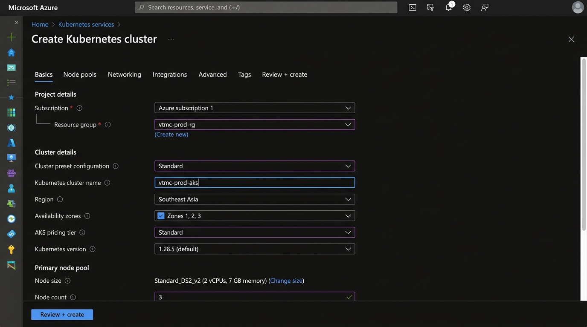

4. Trong tab **Basics**, điền:
   - **Subscription:** `Azure subscription 1`
   - **Resource group:** `vtmc-prod-rg`
   - **Cluster preset configuration:** Chọn `Production Standard`
   - **Kubernetes cluster name:** `vtmc-prod-aks`
   - **Region:** `(Asia Pacific) Southeast Asia`
   - **Availability zones:** Chọn `Zones 1, 2, 3` (tăng tính sẵn sàng)
   - **AKS pricing tier:** `Standard`
   - **Kubernetes version:** Chọn phiên bản **stable mới nhất** (ví dụ: 1.29.x)
   - **Automatic upgrade:** `Patch`
   - **Authentication and Authorization:** `Microsoft Entra ID authentication with Azure RBAC`

5. Trong phần **Node pools** (vẫn trong tab Basics hoặc tab riêng):
   - **System node pool:**
     - **Name:** `system`
     - **Node size:** `Standard_DS2_v2` (2 vCPU, 7 GB RAM)
     - **Scale method:** `Autoscale`
     - **Min count:** `3`
     - **Max count:** `5`

6. Nhấn **"Next: Node pools >"** nếu cần thêm user node pool:
   - Nhấn **"+ Add node pool"**:
     - **Name:** `userpool`
     - **Mode:** `User`
     - **Node size:** `Standard_DS2_v2`
     - **Scale method:** `Autoscale`
     - **Min count:** `2`
     - **Max count:** `10`
     - **Max pods per node:** `30`

7. Nhấn **"Next: Networking >"**.
8. Trong tab **Networking**:
   - **Network configuration:** `Azure CNI`
   - **Virtual network:** Chọn `vtmc-prod-vnet`
   - **Cluster subnet:** Chọn `aks-subnet (10.0.1.0/24)`
   - **Kubernetes service address range:** `10.2.0.0/16`
   - **Kubernetes DNS service IP address:** `10.2.0.10`
   - **Network policy:** `Azure` hoặc `Calico`

9. Nhấn **"Next: Integrations >"**.
10. Trong tab **Integrations**:
    - **Container registry:** Tạo mới hoặc chọn ACR hiện có (nếu có)
    - **Azure Monitor:** Enable **Container insights** ✅
    - **Azure Policy:** Enable ✅

11. Nhấn **"Next: Advanced >"**.
12. Trong tab **Advanced**:
    - **Infrastructure resource group:** Để mặc định hoặc nhập `vtmc-prod-aks-infra-rg`
    - **Enable secret store CSI driver:** ✅ Enable (để tích hợp Key Vault)

13. Nhấn **"Next: Tags >"**, thêm tags:
    - **Project:** `VTMC`
    - **Environment:** `Production`

14. Nhấn **"Review + create"**, kiểm tra validation.
15. Nhấn **"Create"** và đợi deployment (khoảng **5-10 phút**).

> [!WARNING]
> Việc tạo AKS cluster có thể mất **5-10 phút**. Không đóng trình duyệt hoặc hủy deployment trong quá trình này. Nếu deployment thất bại, kiểm tra quota của subscription (đặc biệt là vCPU quota cho region Southeast Asia).

> [!TIP]
> Chọn **Azure CNI** thay vì **kubenet** để mỗi pod nhận IP riêng trong VNet, giúp tích hợp tốt hơn với SQL MI và các dịch vụ khác trong cùng VNet. Tuy nhiên, Azure CNI tiêu tốn nhiều IP hơn — hãy đảm bảo subnet đủ lớn.

> [!IMPORTANT]
> Sau khi AKS được tạo, cần cấu hình thêm:
> 1. **kubectl** trên máy local: `az aks get-credentials --resource-group vtmc-prod-rg --name vtmc-prod-aks`
> 2. **Ingress Controller** (NGINX hoặc Application Gateway Ingress Controller)
> 3. **Cert-Manager** để tự động quản lý TLS certificates
> 4. **Key Vault CSI Driver** để inject secrets vào pods

### 6.3. Bảng tóm tắt cấu hình

| Trường | Giá trị |
|---|---|
| Cluster Name | `vtmc-prod-aks` |
| Resource Group | `vtmc-prod-rg` |
| Region | (Asia Pacific) Southeast Asia |
| Kubernetes Version | Stable mới nhất |
| Node Size | `Standard_DS2_v2` |
| System Node Count | 3-5 (Autoscale) |
| User Node Count | 2-10 (Autoscale) |
| Network Plugin | Azure CNI |
| VNet/Subnet | `vtmc-prod-vnet` / `aks-subnet` |
| Availability Zones | 1, 2, 3 |
| Container Insights | Enabled |
| Secret Store CSI | Enabled |

---

## 7. Tạo Azure SQL Managed Instance

### 7.1. Giới thiệu

**Azure SQL Managed Instance** là dịch vụ cơ sở dữ liệu quan hệ được quản lý hoàn toàn, tương thích gần như 100% với SQL Server on-premises. VTMC cần SQL MI để:

- **Chạy ERP/CRM databases** — các hệ thống đang chạy trên SQL Server tại nhà máy sẽ được migrate lên SQL MI với thay đổi tối thiểu.
- **Đảm bảo tính sẵn sàng cao** — tự động failover, backup, và patching.
- **Giảm chi phí vận hành** — không cần quản lý hardware, OS, patching.
- **Bảo mật dữ liệu** — mã hóa at-rest và in-transit, VNet integration.

### 7.2. Các bước thực hiện

1. Từ trang chủ Azure Portal, nhấn **"+ Create a resource"**.
2. Tìm kiếm **"Azure SQL Managed Instance"** hoặc **"SQL Managed Instance"**.
3. Chọn kết quả **"Azure SQL Managed Instance"**, nhấn **"Create"**.

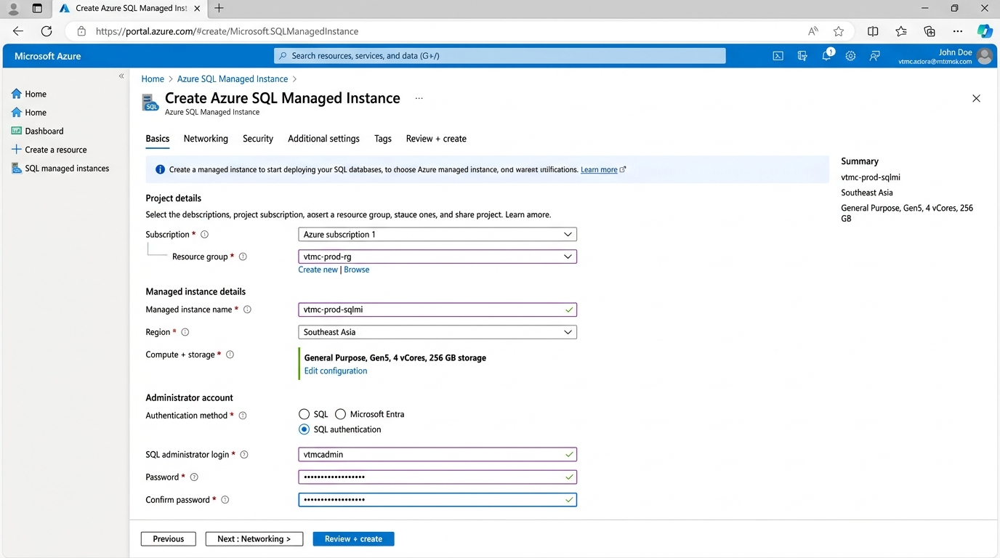

4. Trong tab **Basics**, điền:
   - **Subscription:** `Azure subscription 1`
   - **Resource group:** `vtmc-prod-rg`
   - **Managed instance name:** `vtmc-prod-sqlmi`
   - **Region:** `(Asia Pacific) Southeast Asia`

5. Trong phần **Compute + storage**, nhấn **"Configure Managed Instance"**:
   - **Service tier:** `General Purpose` (phù hợp cho workload OLTP thông thường)
   - **Hardware generation:** `Gen5` (Standard-series)
   - **vCores:** `4`
   - **Storage:** `256 GB`
   - **Backup storage redundancy:** `Geo-redundant backup storage`

6. Trong phần **Authentication**:
   - **Authentication method:** Chọn `SQL authentication` (hoặc `Both` nếu muốn dùng cả Azure AD)
   - **Managed Instance admin login:** `vtmcadmin`
   - **Password:** Nhập mật khẩu mạnh (ít nhất 16 ký tự, bao gồm chữ hoa, chữ thường, số và ký tự đặc biệt)
   - **Confirm password:** Nhập lại mật khẩu

7. Nhấn **"Next: Networking >"**.
8. Trong tab **Networking**:
   - **Virtual network:** Chọn `vtmc-prod-vnet`
   - **Subnet:** Chọn `db-subnet (10.0.3.0/24)`
   - **Connection type:** `Proxy` (mặc định) hoặc `Redirect` (hiệu suất cao hơn)
   - **Public endpoint:** **Disable** (chỉ truy cập qua VNet cho bảo mật)

> [!WARNING]
> SQL Managed Instance yêu cầu **subnet dedicated** (không chia sẻ với tài nguyên khác). Đảm bảo `db-subnet` chỉ được sử dụng cho SQL MI. Ngoài ra, subnet cần có **NSG** và **Route Table** phù hợp — Azure sẽ tự động tạo khi deploy SQL MI.

9. Nhấn **"Next: Security >"**.
10. Trong tab **Security**:
    - **Transparent Data Encryption (TDE):** Enable ✅ (mặc định)
    - **Key management:** `Service-managed key` (hoặc `Customer-managed key` nếu muốn dùng Key Vault)

11. Nhấn **"Next: Additional settings >"**.
12. Trong tab **Additional settings**:
    - **Collation:** `Vietnamese_CI_AS` (hỗ trợ tiếng Việt — chọn collation phù hợp với database hiện tại)
    - **Time zone:** `(UTC+07:00) Bangkok, Hanoi, Jakarta`
    - **Maintenance window:** Chọn khung giờ bảo trì phù hợp (ví dụ: Chủ nhật 2:00 AM — 6:00 AM)

13. Nhấn **"Next: Tags >"**, thêm tags.
14. Nhấn **"Review + create"**, kiểm tra validation.
15. Nhấn **"Create"**.

> [!IMPORTANT]
> SQL Managed Instance có thời gian deployment **rất lâu**: thường **4-6 giờ** cho lần tạo đầu tiên. Đây là hành vi bình thường do Azure cần provision infrastructure riêng. Hãy kiên nhẫn và không hủy deployment.

> [!TIP]
> Sau khi SQL MI được tạo, hãy lưu **connection string** vào Key Vault:  
> `Server=vtmc-prod-sqlmi.xxxxxxxxx.database.windows.net,1433;Database=vtmc_erp;User Id=vtmcadmin;Password=<password>;`  
> Sử dụng **Azure Data Migration Service (DMS)** để migrate dữ liệu từ SQL Server on-premises lên SQL MI.

### 7.3. Bảng tóm tắt cấu hình

| Trường | Giá trị |
|---|---|
| Instance Name | `vtmc-prod-sqlmi` |
| Resource Group | `vtmc-prod-rg` |
| Region | (Asia Pacific) Southeast Asia |
| Service Tier | General Purpose |
| Hardware | Gen5 (Standard-series) |
| vCores | 4 |
| Storage | 256 GB |
| Admin Login | `vtmcadmin` |
| VNet/Subnet | `vtmc-prod-vnet` / `db-subnet` |
| Public Endpoint | Disabled |
| Backup Redundancy | Geo-redundant |
| Collation | Vietnamese_CI_AS |
| Time Zone | UTC+07:00 |

---

## 8. Tạo Azure Cosmos DB

### 8.1. Giới thiệu

**Azure Cosmos DB** là dịch vụ cơ sở dữ liệu NoSQL phân tán toàn cầu với độ trễ cực thấp (< 10ms). VTMC sử dụng Cosmos DB với **MongoDB API** để:

- **Lưu trữ catalog sản phẩm** — dữ liệu bán cấu trúc của hàng ngàn sản phẩm đông dược với nhiều thuộc tính khác nhau.
- **Quản lý dữ liệu IoT** từ dây chuyền sản xuất — dữ liệu cảm biến, telemetry.
- **Session management** cho ứng dụng web/mobile.
- **Tương thích MongoDB** — tái sử dụng code và expertise MongoDB hiện có.

### 8.2. Các bước thực hiện

1. Từ trang chủ Azure Portal, nhấn **"+ Create a resource"**.
2. Tìm kiếm **"Azure Cosmos DB"** trong thanh tìm kiếm.
3. Chọn **"Azure Cosmos DB"**, nhấn **"Create"**.
4. Trong trang chọn API, nhấn **"Create"** bên dưới **"Azure Cosmos DB for MongoDB"**.

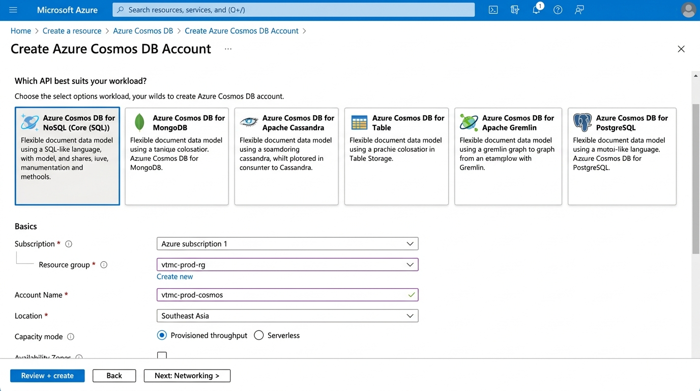

5. Trong tab **Basics**, điền:
   - **Subscription:** `Azure subscription 1`
   - **Resource group:** `vtmc-prod-rg`
   - **Account Name:** `vtmc-prod-cosmos`
   - **Location:** `(Asia Pacific) Southeast Asia`
   - **Capacity mode:** `Provisioned throughput` (hoặc `Serverless` nếu workload không ổn định)
   - **Apply Free Tier Discount:** `Do Not Apply` (production environment)
   - **Limit total account throughput:** Bỏ chọn

6. Nhấn **"Next: Global Distribution >"**.
7. Trong tab **Global Distribution**:
   - **Geo-Redundancy:** `Enable` (backup dữ liệu sang region khác)
   - **Multi-region Writes:** `Disable` (chỉ cần write tại Southeast Asia)
   - Không thêm read region bổ sung lúc này

8. Nhấn **"Next: Networking >"**.
9. Trong tab **Networking**:
   - **Connectivity method:** Chọn **"Private endpoint"**
   - Nhấn **"+ Add"** để tạo private endpoint:
     - **Subscription:** `Azure subscription 1`
     - **Resource group:** `vtmc-prod-rg`
     - **Location:** `Southeast Asia`
     - **Name:** `vtmc-cosmos-pe`
     - **Target sub-resource:** `MongoDB`
     - **Virtual network:** `vtmc-prod-vnet`
     - **Subnet:** `db-subnet`
   - Nhấn **"OK"**

10. Nhấn **"Next: Backup Policy >"**.
11. Trong tab **Backup Policy**:
    - **Backup mode:** `Continuous (7 days)` hoặc `Continuous (30 days)` cho production
    - Chế độ continuous cho phép point-in-time restore

12. Nhấn **"Next: Encryption >"**.
13. Trong tab **Encryption**:
    - **Data Encryption:** `Service-managed key` (mặc định, đủ cho hầu hết trường hợp)

14. Nhấn **"Next: Tags >"**, thêm tags.
15. Nhấn **"Review + create"**, kiểm tra và nhấn **"Create"**.
16. Đợi deployment hoàn tất (khoảng **3-5 phút**).

> [!TIP]
> Sau khi tạo Cosmos DB, truy cập **"Connection strings"** trong menu bên trái để lấy connection string. Lưu connection string vào **Key Vault** (`vtmc-prod-kv`) với tên secret `cosmos-connection-string`.

> [!WARNING]
> **Provisioned throughput** tính phí theo **RU/s (Request Units per second)**. Hãy bắt đầu với 400 RU/s cho mỗi collection và tăng dần theo nhu cầu. Bật **Autoscale** để tự động điều chỉnh throughput và tránh bị throttle.

### 8.3. Bảng tóm tắt cấu hình

| Trường | Giá trị |
|---|---|
| Account Name | `vtmc-prod-cosmos` |
| Resource Group | `vtmc-prod-rg` |
| API | MongoDB (vCore hoặc RU) |
| Region | (Asia Pacific) Southeast Asia |
| Capacity Mode | Provisioned throughput |
| Geo-Redundancy | Enabled |
| Connectivity | Private Endpoint |
| Backup Mode | Continuous (7 hoặc 30 ngày) |
| VNet/Subnet | `vtmc-prod-vnet` / `db-subnet` |

---

## 9. Tạo Azure API Management

### 9.1. Giới thiệu

**Azure API Management (APIM)** là dịch vụ quản lý, bảo vệ và phân tích API. VTMC cần APIM để:

- **Gateway trung tâm** cho tất cả API — ERP, CRM, WMS, Mobile App API đều đi qua APIM.
- **Xác thực & phân quyền** — OAuth 2.0, API keys, JWT validation.
- **Rate limiting & throttling** — bảo vệ backend khỏi quá tải.
- **API documentation** — tự động tạo developer portal cho đối tác và nhà phát triển.
- **Analytics** — theo dõi lượng request, latency, lỗi theo từng API.

### 9.2. Các bước thực hiện

1. Từ trang chủ Azure Portal, nhấn **"+ Create a resource"**.
2. Tìm kiếm **"API Management"** trong thanh tìm kiếm.
3. Chọn **"API Management"**, nhấn **"Create"**.

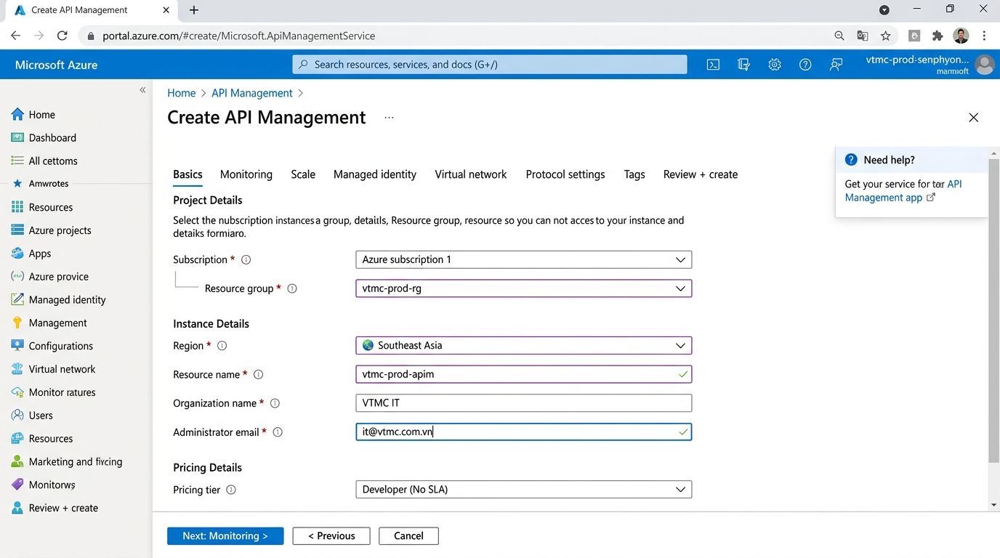

4. Trong tab **Basics**, điền:
   - **Subscription:** `Azure subscription 1`
   - **Resource group:** `vtmc-prod-rg`
   - **Region:** `(Asia Pacific) Southeast Asia`
   - **Resource name:** `vtmc-prod-apim`
   - **Organization name:** `VTMC IT`
   - **Administrator email:** `it@vtmc.com.vn`

5. Trong phần **Pricing tier**:
   - Chọn **`Developer`** (`Developer_1`)
   - *(Lưu ý: Tier Developer không có SLA, chỉ phù hợp cho development/testing. Cho production thực tế, hãy chọn **Standard** hoặc **Premium**)*

6. Nhấn **"Next: Monitoring >"**.
7. Trong tab **Monitoring**:
   - **Application Insights:** Enable ✅
   - Chọn hoặc tạo mới Application Insights instance (sẽ tạo ở bước 13, có thể quay lại cấu hình sau)

8. Nhấn **"Next: Scale >"**.
9. Trong tab **Scale**:
   - **Units:** `1` (cho Developer tier, chỉ hỗ trợ 1 unit)

10. Nhấn **"Next: Managed identity >"**.
11. Trong tab **Managed identity**:
    - **System assigned:** `On` ✅ (cho phép APIM truy cập Key Vault, Azure AD)
    - Sau khi tạo, cấp quyền cho managed identity trên Key Vault

12. Nhấn **"Next: Virtual network >"**.
13. Trong tab **Virtual network**:
    - **Connectivity type:** `None` cho Developer tier
    - *(Cho Premium tier, chọn **Internal** hoặc **External** và gán VNet)*

14. Nhấn **"Next: Protocol settings >"**.
15. Trong tab **Protocol settings**:
    - Giữ mặc định (HTTPS, TLS 1.2)

16. Nhấn **"Next: Tags >"**, thêm tags.
17. Nhấn **"Review + create"**, kiểm tra và nhấn **"Create"**.

> [!WARNING]
> Việc tạo APIM có thể mất **30-60 phút**. Đây là thời gian deployment bình thường cho dịch vụ này. Không hủy deployment.

> [!IMPORTANT]
> Tier **Developer** không có SLA và không phù hợp cho production workload thực tế. Khi chuyển sang production chính thức, hãy nâng cấp lên tier **Standard** (99.95% SLA) hoặc **Premium** (99.99% SLA với multi-region). Tier Developer phù hợp cho giai đoạn phát triển và kiểm thử.

> [!TIP]
> Sau khi APIM hoạt động, cấu hình thêm:
> 1. **Import APIs** từ OpenAPI/Swagger specifications
> 2. **Products** — nhóm API với policies (rate limit, quota)
> 3. **Subscriptions** — cấp API key cho từng ứng dụng/đối tác
> 4. **Policies** — JWT validation, CORS, caching, transformation

### 9.3. Bảng tóm tắt cấu hình

| Trường | Giá trị |
|---|---|
| APIM Name | `vtmc-prod-apim` |
| Resource Group | `vtmc-prod-rg` |
| Region | (Asia Pacific) Southeast Asia |
| Organization Name | `VTMC IT` |
| Admin Email | `it@vtmc.com.vn` |
| Pricing Tier | Developer_1 |
| Managed Identity | System Assigned (On) |
| Application Insights | Enabled |

---

## 10. Tạo Azure Service Bus

### 10.1. Giới thiệu

**Azure Service Bus** là dịch vụ messaging enterprise-grade hỗ trợ hàng đợi (queues) và chủ đề (topics). VTMC cần Service Bus để:

- **Giao tiếp bất đồng bộ** giữa các microservices — ví dụ: khi đơn hàng được tạo, ERP gửi message tới Service Bus, WMS nhận và xử lý xuất kho.
- **Đảm bảo tin nhắn không bị mất** — Service Bus lưu trữ message cho đến khi consumer xử lý thành công.
- **Decouple services** — các service không cần biết nhau, chỉ giao tiếp qua message queue.
- **Dead-letter queue** — xử lý message lỗi một cách có hệ thống.

### 10.2. Các bước thực hiện

1. Từ trang chủ Azure Portal, nhấn **"+ Create a resource"**.
2. Tìm kiếm **"Service Bus"** trong thanh tìm kiếm.
3. Chọn **"Service Bus"**, nhấn **"Create"**.
4. Trong tab **Basics**, điền:
   - **Subscription:** `Azure subscription 1`
   - **Resource group:** `vtmc-prod-rg`
   - **Namespace name:** `vtmc-prod-sb`
   - **Location:** `(Asia Pacific) Southeast Asia`
   - **Pricing tier:** `Standard`
     - *(Standard hỗ trợ Topics, Sessions, và throughput cao hơn Basic)*
     - *(Premium hỗ trợ VNet integration, dedicated capacity — cân nhắc nếu cần)*

5. Nhấn **"Next: Advanced >"**.
6. Trong tab **Advanced**:
   - **Minimum TLS version:** `1.2`
   - **Local Authentication:** `Enabled` (có thể disable sau khi chuyển hoàn toàn sang Managed Identity)

7. Nhấn **"Next: Networking >"**.
8. Trong tab **Networking**:
   - **Connectivity method:** `Public access` cho Standard tier
   - *(Premium tier hỗ trợ Private endpoint — khuyến nghị cho production)*

9. Nhấn **"Next: Tags >"**, thêm tags.
10. Nhấn **"Review + create"**, kiểm tra và nhấn **"Create"**.
11. Đợi deployment hoàn tất (khoảng **1-2 phút**).

### 10.3. Tạo Queues & Topics

Sau khi namespace được tạo, cần tạo các queue/topic:

12. Truy cập **Service Bus namespace** → menu bên trái chọn **"Queues"**.
13. Nhấn **"+ Queue"** để tạo queue mới:
    - **Name:** `order-processing`
    - **Max queue size:** `1 GB`
    - **Message time to live:** `14 days`
    - **Lock duration:** `30 seconds`
    - **Enable dead lettering on message expiration:** ✅
    - **Enable sessions:** Bỏ chọn (trừ khi cần ordered processing)
    - Nhấn **"Create"**

14. Tạo thêm các queue khác:
    - `inventory-updates` — cập nhật tồn kho
    - `notification-queue` — gửi thông báo email/SMS
    - `audit-events` — ghi nhận sự kiện kiểm toán

15. Chọn **"Topics"** từ menu bên trái → nhấn **"+ Topic"**:
    - **Name:** `order-events`
    - **Max topic size:** `1 GB`
    - Nhấn **"Create"**

16. Truy cập topic `order-events` → **"+ Subscription"**:
    - Tạo subscription `wms-subscriber` (cho WMS)
    - Tạo subscription `crm-subscriber` (cho CRM)
    - Tạo subscription `notification-subscriber` (cho Notification Service)

> [!TIP]
> Lưu **connection string** của Service Bus vào Key Vault. Truy cập **"Shared access policies"** → chọn `RootManageSharedAccessKey` → copy **Primary Connection String** → lưu vào `vtmc-prod-kv` với secret name `sb-connection-string`.

### 10.4. Bảng tóm tắt cấu hình

| Trường | Giá trị |
|---|---|
| Namespace Name | `vtmc-prod-sb` |
| Resource Group | `vtmc-prod-rg` |
| Region | (Asia Pacific) Southeast Asia |
| Pricing Tier | Standard |
| Min TLS Version | 1.2 |
| Queues | `order-processing`, `inventory-updates`, `notification-queue`, `audit-events` |
| Topics | `order-events` |
| Subscriptions | `wms-subscriber`, `crm-subscriber`, `notification-subscriber` |

---

## 11. Tạo Azure Event Hub

### 11.1. Giới thiệu

**Azure Event Hub** là dịch vụ streaming dữ liệu lớn (big data streaming platform) có khả năng xử lý hàng triệu sự kiện mỗi giây. VTMC cần Event Hub để:

- **Thu thập dữ liệu IoT** từ dây chuyền sản xuất đông dược (nhiệt độ, độ ẩm, áp suất).
- **Streaming telemetry** từ ứng dụng — user behavior, performance metrics.
- **Event sourcing** — ghi lại toàn bộ sự kiện trong hệ thống để audit và replay.
- **Tích hợp với Azure Stream Analytics** để xử lý dữ liệu real-time.

### 11.2. Các bước thực hiện

1. Từ trang chủ Azure Portal, nhấn **"+ Create a resource"**.
2. Tìm kiếm **"Event Hubs"** trong thanh tìm kiếm.
3. Chọn **"Event Hubs"**, nhấn **"Create"**.
4. Trong tab **Basics**, điền:
   - **Subscription:** `Azure subscription 1`
   - **Resource group:** `vtmc-prod-rg`
   - **Namespace name:** `vtmc-prod-eh`
   - **Location:** `(Asia Pacific) Southeast Asia`
   - **Pricing tier:** `Standard`
   - **Throughput Units:** `1` (mỗi TU = 1 MB/s ingress, 2 MB/s egress)
   - **Enable Auto-Inflate:** ✅ Enable
   - **Auto-Inflate Maximum Throughput Units:** `10`

5. Nhấn **"Next: Advanced >"**.
6. Trong tab **Advanced**:
   - **Minimum TLS version:** `1.2`
   - **Local Authentication:** `Enabled`
   - **Kafka surface:** `Enabled` ✅ (cho phép sử dụng Kafka protocol)

7. Nhấn **"Next: Networking >"**.
8. Trong tab **Networking**:
   - **Connectivity method:** `Public access` cho Standard tier

9. Nhấn **"Next: Tags >"**, thêm tags.
10. Nhấn **"Review + create"**, kiểm tra và nhấn **"Create"**.
11. Đợi deployment hoàn tất (khoảng **1-2 phút**).

### 11.3. Tạo Event Hubs

12. Truy cập **Event Hub namespace** → nhấn **"+ Event Hub"**.
13. Tạo Event Hub đầu tiên:
    - **Name:** `iot-telemetry`
    - **Partition Count:** `4` (tăng tính song song khi xử lý)
    - **Message Retention:** `7 days` (Standard tier hỗ trợ tối đa 7 ngày)
    - **Capture:** Enable nếu muốn tự động lưu dữ liệu vào Azure Storage/Data Lake
    - Nhấn **"Create"**

14. Tạo thêm Event Hub:
    - `app-events` — sự kiện ứng dụng (user clicks, page views)
    - `audit-trail` — dữ liệu kiểm toán chi tiết

15. Cấu hình **Consumer Groups** cho mỗi Event Hub:
    - Truy cập Event Hub → **"Consumer groups"** → **"+ Consumer group"**
    - Tạo: `stream-analytics-cg` (cho Azure Stream Analytics)
    - Tạo: `databricks-cg` (cho Azure Databricks, nếu sử dụng)

> [!TIP]
> **Partition Count** không thể thay đổi sau khi tạo Event Hub. Hãy cân nhắc kỹ — 4 partitions là đủ cho hầu hết use cases. Tăng lên 8 hoặc 16 nếu dự kiến throughput cao.

> [!IMPORTANT]
> Sự khác biệt giữa **Service Bus** và **Event Hub**:
> - **Service Bus** = message queue (1 message → 1 consumer, đảm bảo thứ tự, xóa sau khi xử lý)
> - **Event Hub** = event streaming (1 event → nhiều consumers, giữ lại trong retention period)
> 
> VTMC sử dụng cả hai: Service Bus cho giao tiếp giữa microservices, Event Hub cho streaming dữ liệu IoT và telemetry.

### 11.4. Bảng tóm tắt cấu hình

| Trường | Giá trị |
|---|---|
| Namespace Name | `vtmc-prod-eh` |
| Resource Group | `vtmc-prod-rg` |
| Region | (Asia Pacific) Southeast Asia |
| Pricing Tier | Standard |
| Throughput Units | 1 TU (Auto-Inflate đến 10) |
| Kafka Surface | Enabled |
| Event Hubs | `iot-telemetry`, `app-events`, `audit-trail` |
| Partition Count | 4 |
| Message Retention | 7 ngày |

---

## 12. Tạo Azure OpenAI & Face API

### 12.1. Giới thiệu

**Azure OpenAI Service** và **Azure Face API** là các dịch vụ AI/ML giúp VTMC ứng dụng trí tuệ nhân tạo vào hoạt động kinh doanh:

- **Azure OpenAI:**
  - Chatbot tư vấn sản phẩm đông dược — sử dụng GPT models để trả lời câu hỏi của khách hàng.
  - Tóm tắt và phân tích báo cáo — tự động phân tích dữ liệu bán hàng.
  - Dịch thuật tài liệu đông dược cổ (Hán-Nôm → Tiếng Việt hiện đại).
  - RAG (Retrieval-Augmented Generation) với AI Search để tra cứu bài thuốc.

- **Azure Face API:**
  - Nhận diện khuôn mặt nhân viên cho hệ thống chấm công.
  - Xác minh danh tính tại các khu vực sản xuất hạn chế.

### 12.2. Tạo Azure OpenAI Service

1. Từ trang chủ Azure Portal, nhấn **"+ Create a resource"**.
2. Tìm kiếm **"Azure OpenAI"** trong thanh tìm kiếm.
3. Chọn **"Azure OpenAI"**, nhấn **"Create"**.

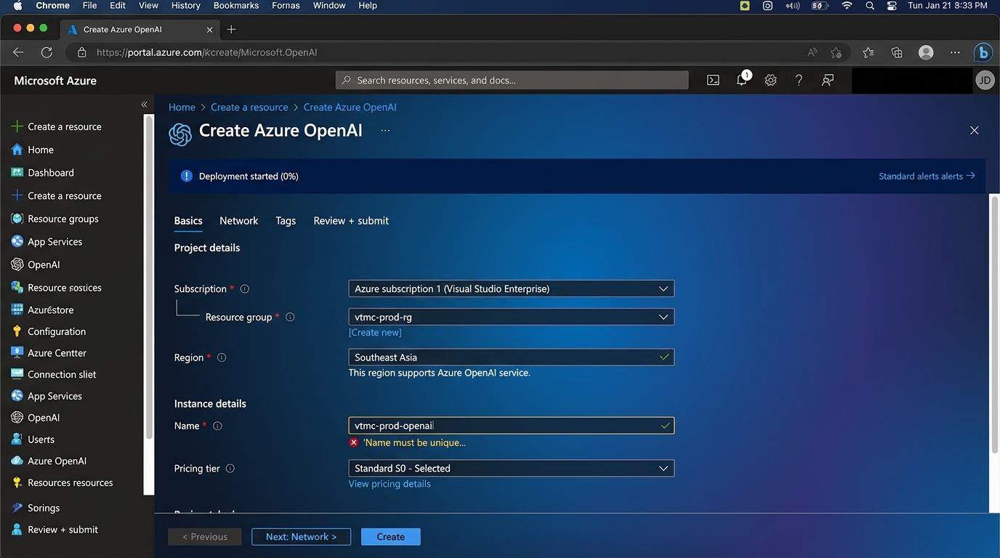

4. Trong tab **Basics**, điền:
   - **Subscription:** `Azure subscription 1`
   - **Resource group:** `vtmc-prod-rg`
   - **Region:** `(Asia Pacific) Southeast Asia` *(Lưu ý: một số model có thể chưa available ở region này, có thể cần chọn East US hoặc West Europe)*
   - **Name:** `vtmc-prod-openai`
   - **Pricing tier:** `Standard S0`

5. Nhấn **"Next: Network >"**.
6. Trong tab **Network**:
   - **Type:** Chọn **"All networks, including the internet, can access this resource"** (cho giai đoạn đầu)
   - *(Sau này chuyển sang Private endpoint cho production)*

7. Nhấn **"Next: Tags >"**, thêm tags.
8. Nhấn **"Review + submit"**, kiểm tra và nhấn **"Create"**.
9. Đợi deployment hoàn tất (khoảng **2-3 phút**).

### 12.3. Deploy OpenAI Models

10. Truy cập **Azure OpenAI resource** → nhấn **"Go to Azure OpenAI Studio"** (hoặc truy cập https://oai.azure.com).
11. Trong OpenAI Studio → **"Deployments"** → **"+ Create new deployment"**:
    - **Model:** `gpt-4o` (hoặc `gpt-4o-mini` cho chi phí thấp hơn)
    - **Deployment name:** `vtmc-gpt4o`
    - **Deployment type:** `Standard`
    - **Tokens per Minute Rate Limit:** `10K` (điều chỉnh theo nhu cầu)
    - Nhấn **"Create"**

12. Tạo thêm deployment cho embedding model:
    - **Model:** `text-embedding-ada-002`
    - **Deployment name:** `vtmc-embedding`
    - **Tokens per Minute Rate Limit:** `10K`

### 12.4. Tạo Azure AI Search (cho RAG)

13. Quay lại Azure Portal → **"+ Create a resource"** → tìm **"AI Search"**.
14. Nhấn **"Create"**, điền:
    - **Subscription:** `Azure subscription 1`
    - **Resource group:** `vtmc-prod-rg`
    - **Service name:** `vtmc-prod-search`
    - **Location:** `(Asia Pacific) Southeast Asia`
    - **Pricing tier:** `Basic` (đủ cho dự án ban đầu)
15. Nhấn **"Review + create"** → **"Create"**.

### 12.5. Tạo Azure Face API

16. Quay lại Azure Portal → **"+ Create a resource"** → tìm **"Face"**.
17. Chọn **"Face"** (trong danh mục Azure AI Services), nhấn **"Create"**.
18. Trong tab **Basics**, điền:
    - **Subscription:** `Azure subscription 1`
    - **Resource group:** `vtmc-prod-rg`
    - **Region:** `(Asia Pacific) Southeast Asia`
    - **Name:** `vtmc-prod-face`
    - **Pricing tier:** `Standard S0`

19. Nhấn **"Next: Network >"** → giữ mặc định.
20. Nhấn **"Next: Identity >"** → bật **System assigned managed identity** ✅.
21. Nhấn **"Review + create"** → **"Create"**.

> [!WARNING]
> Azure OpenAI Service yêu cầu **đăng ký truy cập** (access request) trước khi sử dụng. Nếu subscription chưa được phê duyệt, bạn sẽ thấy lỗi khi tạo resource. Hãy truy cập https://aka.ms/oai/access để đăng ký. Thời gian phê duyệt có thể mất **1-5 ngày làm việc**.

> [!IMPORTANT]
> **API Keys** của Azure OpenAI và Face API là thông tin nhạy cảm. Sau khi tạo:
> 1. Truy cập resource → **"Keys and Endpoint"**
> 2. Copy **Key 1** và **Endpoint**
> 3. Lưu vào **Key Vault** (`vtmc-prod-kv`):
>    - Secret: `openai-api-key` → Giá trị: Key 1
>    - Secret: `openai-endpoint` → Giá trị: Endpoint URL
>    - Secret: `face-api-key` → Giá trị: Face API Key 1

> [!TIP]
> Sử dụng **Managed Identity** thay vì API key khi có thể. Cấp quyền **Cognitive Services OpenAI User** cho AKS managed identity trên Azure OpenAI resource để không cần lưu API key.

### 12.6. Bảng tóm tắt cấu hình

| Trường | Giá trị |
|---|---|
| OpenAI Name | `vtmc-prod-openai` |
| OpenAI Pricing | Standard S0 |
| GPT Model Deployment | `vtmc-gpt4o` (gpt-4o) |
| Embedding Deployment | `vtmc-embedding` (text-embedding-ada-002) |
| AI Search Name | `vtmc-prod-search` |
| AI Search Tier | Basic |
| Face API Name | `vtmc-prod-face` |
| Face API Pricing | Standard S0 |
| Resource Group | `vtmc-prod-rg` |
| Region | (Asia Pacific) Southeast Asia |

---

## 13. Tạo Log Analytics & Application Insights

### 13.1. Giới thiệu

**Log Analytics Workspace** và **Application Insights** là hai thành phần cốt lõi của **Azure Monitor**, cung cấp khả năng giám sát toàn diện cho hạ tầng VTMC:

- **Log Analytics Workspace:**
  - Thu thập và lưu trữ logs từ tất cả tài nguyên Azure (AKS, SQL MI, Cosmos DB, APIM...).
  - Truy vấn logs bằng **Kusto Query Language (KQL)**.
  - Tạo **alerts** khi phát hiện bất thường.
  - **Dashboard** tổng quan sức khỏe hệ thống.

- **Application Insights:**
  - Theo dõi performance ứng dụng (response time, failure rate, throughput).
  - **Distributed tracing** — theo dõi request xuyên suốt các microservices.
  - **Live metrics** — xem metrics real-time.
  - **Smart detection** — tự động phát hiện anomalies.

### 13.2. Tạo Log Analytics Workspace

1. Từ trang chủ Azure Portal, nhấn **"+ Create a resource"**.
2. Tìm kiếm **"Log Analytics Workspace"** trong thanh tìm kiếm.
3. Chọn **"Log Analytics workspace"**, nhấn **"Create"**.
4. Trong tab **Basics**, điền:
   - **Subscription:** `Azure subscription 1`
   - **Resource group:** `vtmc-prod-rg`
   - **Name:** `vtmc-prod-law`
   - **Region:** `(Asia Pacific) Southeast Asia`

5. Nhấn **"Next: Pricing tier >"**.
6. Trong tab **Pricing tier**:
   - **Pricing tier:** `Pay-As-You-Go (Per GB 2018)`
   - **Data retention:** `90 days` (mặc định 30 ngày miễn phí, tăng lên 90 cho compliance)
   - **Daily cap:** Không đặt giới hạn ban đầu (theo dõi chi phí sau)

7. Nhấn **"Next: Tags >"**, thêm tags.
8. Nhấn **"Review + Create"**, kiểm tra và nhấn **"Create"**.
9. Đợi deployment hoàn tất (khoảng **1 phút**).

### 13.3. Tạo Application Insights

10. Từ trang chủ Azure Portal, nhấn **"+ Create a resource"**.
11. Tìm kiếm **"Application Insights"** trong thanh tìm kiếm.
12. Chọn **"Application Insights"**, nhấn **"Create"**.
13. Trong tab **Basics**, điền:
    - **Subscription:** `Azure subscription 1`
    - **Resource group:** `vtmc-prod-rg`
    - **Name:** `vtmc-prod-appinsights`
    - **Region:** `(Asia Pacific) Southeast Asia`
    - **Resource Mode:** `Workspace-based` ✅
    - **Log Analytics Workspace:** Chọn `vtmc-prod-law` (workspace vừa tạo ở trên)

14. Nhấn **"Next: Tags >"**, thêm tags.
15. Nhấn **"Review + Create"**, kiểm tra và nhấn **"Create"**.
16. Đợi deployment hoàn tất (khoảng **1 phút**).

### 13.4. Cấu hình Diagnostic Settings cho tất cả tài nguyên

Sau khi tạo Log Analytics Workspace, cần bật **Diagnostic Settings** cho từng tài nguyên để gửi logs và metrics về workspace:

17. Truy cập từng tài nguyên (AKS, SQL MI, Cosmos DB, APIM, Service Bus, Event Hub...) → menu bên trái chọn **"Diagnostic settings"** (trong nhóm **Monitoring**).

18. Nhấn **"+ Add diagnostic setting"**, cấu hình:
    - **Diagnostic setting name:** `send-to-law`
    - **Logs:** Tích chọn tất cả category logs cần thiết ✅
    - **Metrics:** Tích chọn `AllMetrics` ✅
    - **Destination details:** Chọn **"Send to Log Analytics workspace"** → `vtmc-prod-law`
    - Nhấn **"Save"**

19. Lặp lại bước 17-18 cho **tất cả** tài nguyên:

| Tài nguyên | Category Logs quan trọng |
|---|---|
| AKS (`vtmc-prod-aks`) | `kube-apiserver`, `kube-audit`, `kube-controller-manager`, `cluster-autoscaler`, `guard` |
| SQL MI (`vtmc-prod-sqlmi`) | `SQLInsights`, `Errors`, `DatabaseWaitStatistics`, `Deadlocks` |
| Cosmos DB (`vtmc-prod-cosmos`) | `DataPlaneRequests`, `QueryRuntimeStatistics`, `ControlPlaneRequests` |
| APIM (`vtmc-prod-apim`) | `GatewayLogs`, `WebSocketConnectionLogs` |
| Front Door (`vtmc-prod-frontdoor`) | `FrontDoorAccessLog`, `FrontDoorHealthProbeLog`, `FrontDoorWebApplicationFirewallLog` |
| Service Bus (`vtmc-prod-sb`) | `OperationalLogs`, `VNetAndIPFilteringLogs` |
| Event Hub (`vtmc-prod-eh`) | `ArchiveLogs`, `OperationalLogs`, `AutoScaleLogs` |
| Key Vault (`vtmc-prod-kv`) | `AuditEvent`, `AzurePolicyEvaluationDetails` |

### 13.5. Tạo Alerts cơ bản

20. Truy cập **Azure Monitor** (tìm kiếm "Monitor" trong thanh tìm kiếm) → **"Alerts"** → **"+ Create alert rule"**.

21. Tạo các alert rules quan trọng:

**Alert 1: AKS Node CPU > 80%**
- **Scope:** `vtmc-prod-aks`
- **Condition:** Metric → `node_cpu_usage_percentage` → Threshold: Static → Operator: Greater than → Value: `80`
- **Action group:** Tạo action group `vtmc-alerts-ag` với email notification đến `it@vtmc.com.vn`
- **Alert rule name:** `AKS-High-CPU`
- **Severity:** `Sev 2 - Warning`

**Alert 2: SQL MI Storage > 80%**
- **Scope:** `vtmc-prod-sqlmi`
- **Condition:** Metric → `storage_space_used_mb` → Custom threshold
- **Alert rule name:** `SQLMI-Storage-Warning`

**Alert 3: APIM Failed Requests > 100/5min**
- **Scope:** `vtmc-prod-apim`
- **Condition:** Metric → `Failed Requests` → Threshold: `100` per 5 minutes
- **Alert rule name:** `APIM-High-Failure-Rate`

**Alert 4: Cosmos DB RU Consumption > 90%**
- **Scope:** `vtmc-prod-cosmos`
- **Condition:** Metric → `NormalizedRUConsumption` → Threshold: `90`
- **Alert rule name:** `CosmosDB-High-RU`

### 13.6. Tạo Dashboard

22. Truy cập **Azure Portal** → nhấn **"Dashboard"** trên thanh menu trên cùng.
23. Nhấn **"+ New dashboard"** → **"Blank dashboard"**.
24. Đặt tên: `VTMC Production Monitoring`.
25. Thêm các tiles:
    - **AKS Cluster Health** — kéo thả Metrics chart cho AKS
    - **SQL MI Performance** — kéo thả Metrics chart cho SQL MI
    - **APIM Request Volume** — kéo thả Metrics chart cho APIM
    - **Cosmos DB RU Consumption** — kéo thả Metrics chart cho Cosmos DB
    - **Active Alerts** — kéo thả Alerts summary
    - **Resource Health** — kéo thả Resource health overview
26. Nhấn **"Save"** và **"Share"** với team IT.

> [!TIP]
> Sử dụng **KQL (Kusto Query Language)** để tạo custom queries trong Log Analytics. Ví dụ, để xem tất cả error logs trong 24 giờ qua:
> ```kql
> union *
> | where TimeGenerated > ago(24h)
> | where Level == "Error" or ResultType == "Failed"
> | summarize Count=count() by ResourceType, bin(TimeGenerated, 1h)
> | render timechart
> ```

> [!IMPORTANT]
> **Chi phí Log Analytics** phụ thuộc vào lượng data ingested. Với toàn bộ hạ tầng VTMC, dự kiến khoảng **5-20 GB/ngày**. Theo dõi chi phí hàng tuần qua **Cost Management** và thiết lập **budget alerts** để tránh bất ngờ.

> [!WARNING]
> Không bật **tất cả** category logs cho mọi tài nguyên nếu không cần thiết — điều này có thể tạo ra lượng data rất lớn và chi phí cao. Chỉ bật các categories thực sự cần thiết cho monitoring và troubleshooting.

### 13.7. Bảng tóm tắt cấu hình

| Trường | Giá trị |
|---|---|
| Log Analytics Name | `vtmc-prod-law` |
| Resource Group | `vtmc-prod-rg` |
| Region | (Asia Pacific) Southeast Asia |
| Pricing Tier | Pay-As-You-Go (Per GB 2018) |
| Data Retention | 90 ngày |
| App Insights Name | `vtmc-prod-appinsights` |
| App Insights Mode | Workspace-based |
| Linked Workspace | `vtmc-prod-law` |
| Alert Action Group | `vtmc-alerts-ag` |
| Alert Email | `it@vtmc.com.vn` |
| Dashboard | VTMC Production Monitoring |

---

## Phụ lục A: Bảng tổng hợp toàn bộ tài nguyên

Bảng sau liệt kê toàn bộ tài nguyên Azure được tạo trong hướng dẫn này:

| # | Tên tài nguyên | Loại dịch vụ | SKU/Tier | Region |
|---|---|---|---|---|
| 1 | `vtmc-prod-rg` | Resource Group | — | Southeast Asia |
| 2 | `vtmc-prod-vnet` | Virtual Network | — | Southeast Asia |
| 3 | `vtmc-prod-frontdoor` | Front Door | Standard | Global |
| 4 | `vtmc-prod-kv` | Key Vault | Standard | Southeast Asia |
| 5 | `vtmc-prod-aks` | Kubernetes Service | Standard | Southeast Asia |
| 6 | `vtmc-prod-sqlmi` | SQL Managed Instance | GP, Gen5, 4 vCores | Southeast Asia |
| 7 | `vtmc-prod-cosmos` | Cosmos DB | MongoDB API | Southeast Asia |
| 8 | `vtmc-prod-apim` | API Management | Developer_1 | Southeast Asia |
| 9 | `vtmc-prod-sb` | Service Bus | Standard | Southeast Asia |
| 10 | `vtmc-prod-eh` | Event Hubs | Standard, 1 TU | Southeast Asia |
| 11 | `vtmc-prod-openai` | Azure OpenAI | Standard S0 | Southeast Asia |
| 12 | `vtmc-prod-face` | Face API | Standard S0 | Southeast Asia |
| 13 | `vtmc-prod-search` | AI Search | Basic | Southeast Asia |
| 14 | `vtmc-prod-law` | Log Analytics | Pay-As-You-Go | Southeast Asia |
| 15 | `vtmc-prod-appinsights` | Application Insights | Workspace-based | Southeast Asia |

---

## Phụ lục B: Thứ tự tạo tài nguyên (Dependency Order)

Do một số tài nguyên phụ thuộc vào tài nguyên khác, hãy tuân thủ thứ tự tạo sau:

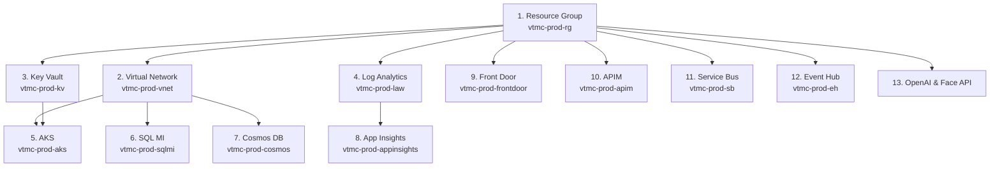

> [!IMPORTANT]
> Một số tài nguyên có thời gian deployment rất lâu. Dưới đây là ước tính thời gian:
> 
> | Tài nguyên | Thời gian ước tính |
> |---|---|
> | Resource Group | 5-10 giây |
> | Virtual Network | 30 giây — 1 phút |
> | Key Vault | 1-2 phút |
> | AKS | 5-10 phút |
> | SQL Managed Instance | **4-6 giờ** |
> | Cosmos DB | 3-5 phút |
> | API Management | **30-60 phút** |
> | Service Bus | 1-2 phút |
> | Event Hub | 1-2 phút |
> | OpenAI | 2-3 phút |
> | Face API | 1-2 phút |
> | Log Analytics | 1 phút |
> | Application Insights | 1 phút |
> | Front Door | 5-10 phút |
> | **Tổng cộng** | **~5-7 giờ** |

---

## Phụ lục C: Các bước hậu cấu hình (Post-Configuration)

Sau khi tạo xong tất cả tài nguyên, thực hiện các bước cấu hình bổ sung:

### C.1. Cấu hình RBAC (Role-Based Access Control)

1. Truy cập mỗi tài nguyên → **"Access control (IAM)"** → **"+ Add role assignment"**.
2. Gán quyền cho AKS Managed Identity:
   - **Key Vault:** `Key Vault Secrets User`
   - **Azure OpenAI:** `Cognitive Services OpenAI User`
   - **Cosmos DB:** `Cosmos DB Account Reader`
   - **Service Bus:** `Azure Service Bus Data Sender` + `Azure Service Bus Data Receiver`
   - **Event Hub:** `Azure Event Hubs Data Sender` + `Azure Event Hubs Data Receiver`

### C.2. Cấu hình Network Security Groups (NSG)

1. Tạo NSG cho mỗi subnet: `aks-nsg`, `agw-nsg`, `db-nsg`.
2. Truy cập **Virtual Network** → chọn subnet → gán NSG tương ứng.
3. Cấu hình rules:
   - `aks-subnet`: Cho phép inbound từ `agw-subnet` (port 80, 443), deny tất cả khác.
   - `agw-subnet`: Cho phép inbound từ Internet (port 80, 443), GatewayManager.
   - `db-subnet`: Cho phép inbound từ `aks-subnet` (port 1433, 10255), deny tất cả khác.

### C.3. Lưu Secrets vào Key Vault

1. Truy cập **Key Vault** (`vtmc-prod-kv`) → **"Secrets"** → **"+ Generate/Import"**.
2. Thêm các secrets:

| Secret Name | Nguồn giá trị |
|---|---|
| `sql-admin-password` | Mật khẩu SQL MI admin |
| `sql-connection-string` | SQL MI → Connection strings |
| `cosmos-connection-string` | Cosmos DB → Connection strings |
| `sb-connection-string` | Service Bus → Shared access policies |
| `eh-connection-string` | Event Hub → Shared access policies |
| `openai-api-key` | Azure OpenAI → Keys and Endpoint |
| `openai-endpoint` | Azure OpenAI → Keys and Endpoint |
| `face-api-key` | Face API → Keys and Endpoint |
| `appinsights-connection-string` | App Insights → Properties |

### C.4. Cập nhật Front Door Origins

1. Sau khi AKS được tạo và có Ingress Controller:
   - Lấy External IP của Ingress: `kubectl get svc -n ingress-nginx`
   - Truy cập **Front Door** → **"Origin groups"** → cập nhật **Host name** với IP hoặc FQDN của AKS Ingress.

---

## Phụ lục D: Ước tính chi phí hàng tháng

| Tài nguyên | SKU | Chi phí ước tính (USD/tháng) |
|---|---|---|
| AKS (5 nodes DS2_v2) | Standard | ~$730 |
| SQL Managed Instance (GP, 4 vCores) | General Purpose | ~$440 |
| Cosmos DB (400 RU/s) | Provisioned | ~$25 |
| API Management | Developer | ~$50 |
| Front Door | Standard | ~$35 + traffic |
| Key Vault | Standard | ~$5 |
| Service Bus | Standard | ~$10 |
| Event Hub (1 TU) | Standard | ~$11 |
| Azure OpenAI | Pay-per-use | ~$50-200 (tùy usage) |
| Face API | S0 | ~$1/1000 calls |
| AI Search | Basic | ~$75 |
| Log Analytics | Per GB | ~$50-200 (tùy data volume) |
| Application Insights | Workspace-based | Included in LAW |
| **Tổng ước tính** | | **~$1,500 - $2,000/tháng** |

> [!WARNING]
> Đây chỉ là ước tính sơ bộ. Chi phí thực tế phụ thuộc vào mức sử dụng. Hãy thiết lập **Budget alerts** trong **Cost Management** để theo dõi chi phí:
> 1. Truy cập **Cost Management + Billing** → **"Budgets"** → **"+ Add"**
> 2. Đặt budget: $2,000/tháng
> 3. Cấu hình alerts tại 50%, 80%, 100% budget

---

## Phụ lục E: Checklist hoàn thành

Sử dụng checklist sau để đảm bảo tất cả bước đã hoàn thành:

- [ ] ✅ Đăng nhập Azure Portal thành công
- [ ] ✅ Tạo Resource Group `vtmc-prod-rg`
- [ ] ✅ Tạo Virtual Network `vtmc-prod-vnet` với 3 subnets
- [ ] ✅ Tạo Azure Front Door `vtmc-prod-frontdoor` với WAF policy
- [ ] ✅ Tạo Key Vault `vtmc-prod-kv` với RBAC
- [ ] ✅ Tạo AKS cluster `vtmc-prod-aks` với 5 nodes
- [ ] ✅ Tạo SQL Managed Instance `vtmc-prod-sqlmi`
- [ ] ✅ Tạo Cosmos DB `vtmc-prod-cosmos` (MongoDB API)
- [ ] ✅ Tạo API Management `vtmc-prod-apim`
- [ ] ✅ Tạo Service Bus `vtmc-prod-sb` với queues & topics
- [ ] ✅ Tạo Event Hub `vtmc-prod-eh` với event hubs
- [ ] ✅ Tạo Azure OpenAI `vtmc-prod-openai` với model deployments
- [ ] ✅ Tạo Azure Face API `vtmc-prod-face`
- [ ] ✅ Tạo AI Search `vtmc-prod-search`
- [ ] ✅ Tạo Log Analytics `vtmc-prod-law`
- [ ] ✅ Tạo Application Insights `vtmc-prod-appinsights`
- [ ] ✅ Cấu hình Diagnostic Settings cho tất cả tài nguyên
- [ ] ✅ Cấu hình RBAC cho managed identities
- [ ] ✅ Cấu hình NSG cho subnets
- [ ] ✅ Lưu tất cả secrets vào Key Vault
- [ ] ✅ Cập nhật Front Door origins với AKS endpoint
- [ ] ✅ Tạo Alert rules và Action groups
- [ ] ✅ Tạo Monitoring dashboard
- [ ] ✅ Thiết lập Budget alerts

---

> **Lưu ý cuối cùng:** Hướng dẫn này mô tả cách cấu hình thủ công qua Azure Portal GUI. Đối với môi trường production thực tế, **khuyến nghị sử dụng Infrastructure as Code (Terraform)** để đảm bảo tính nhất quán, khả năng tái tạo, và version control. Tham khảo thư mục `terraform/` trong repository để xem cấu hình Terraform tương đương.

---

*Tài liệu được tạo bởi VTMC IT Team — Bản quyền © 2026 Vietnamese Traditional Medicine Company*
